# Demo — weather-forecast seller (end to end)

This walkthrough follows the full BNBChain Studio path for a single example: a **weather-forecast seller** on BSC testnet. You install the CLI, scaffold the agent with your AI IDE, set up a wallet, fund it, activate an LLM, run locally, negotiate a sale, register on-chain, and deploy.

Commands and behavior match the [bnbagent-studio](https://github.com/bnb-chain/bnbagent-studio) repository — see the [weather seller example](https://github.com/bnb-chain/bnbagent-studio#-example-a-weather-forecast-seller-end-to-end) in the README for the canonical reference.

## Prerequisites

| Requirement | Notes |
|-------------|-------|
| Python ≥ 3.10 | CLI and runtime library |
| Claude Code, Cursor, or another AI IDE | Studio is driven via skills + natural language |
| Node ≥ 20 + AgentCore CLI | Required for `bag init`, `bag dev`, `bag deploy agent` |
| A wallet password you choose | Never committed to git; kept in `WALLET_PASSWORD` env only |

## 1. Installation

Install `bnbagent-studio`, the AgentCore CLI, and the studio skills. Reload your IDE after installing skills.

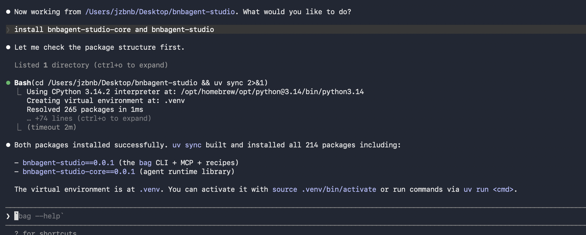{:style="width:800px"}

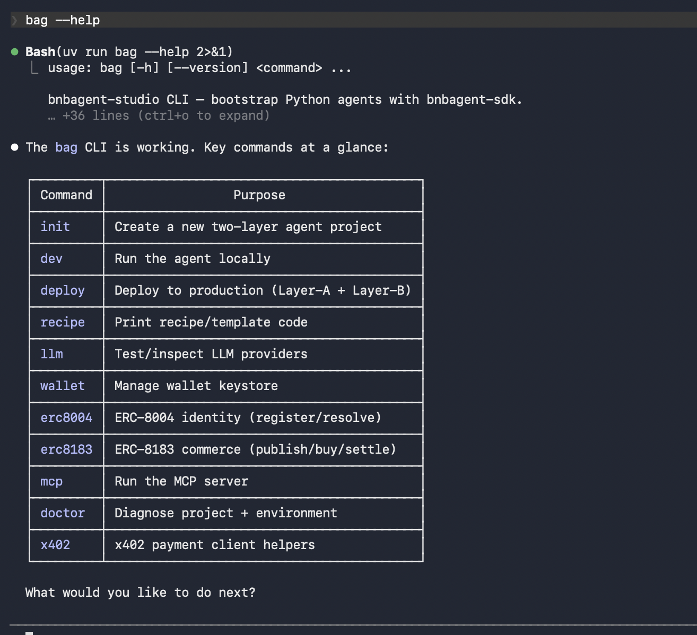{:style="width:800px"}

## 2. Start vibe coding

Open your AI tool in an empty workspace folder and ask it to create a BNB agent named **weather-seller** on testnet that sells weather forecasts. The scaffolding skill runs `bag init` and sets up the two-layer workspace (`app/agent/` + `app/service/`). See [Quickstart](quickstart.md) for the emitted layout.

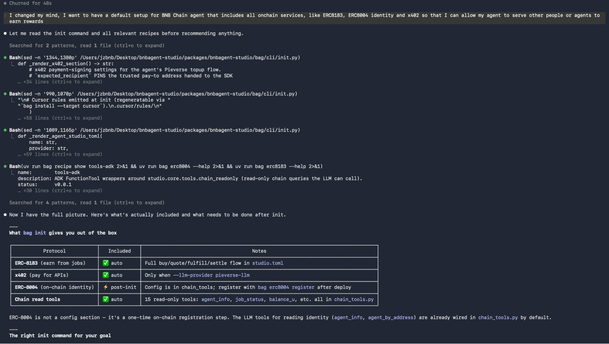{:style="width:800px"}

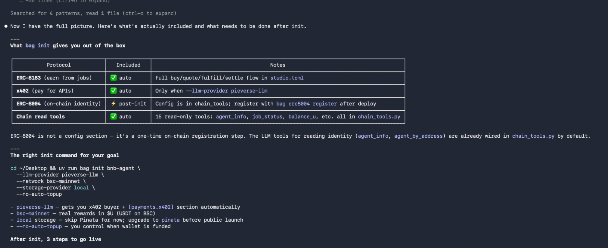{:style="width:800px"}

## 3. Agent wallet setup

`bag init` prompts for a wallet password and creates an encrypted keystore at `.studio/wallets/` (workspace root, outside `app/agent/`). Set `WALLET_PASSWORD` in a **separate terminal session** from your AI tool so the password never appears in chat context.

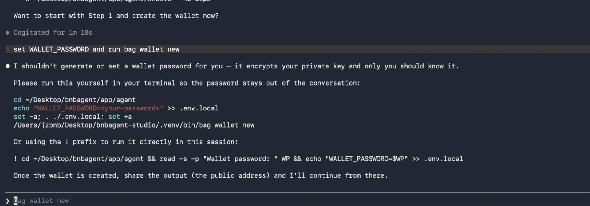{:style="width:800px"}

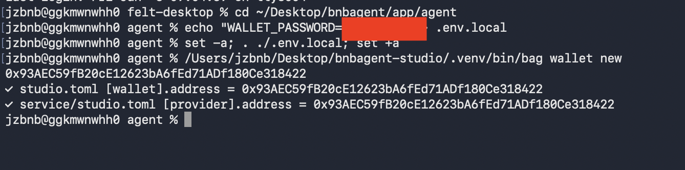{:style="width:800px"}

## 4. Fund the wallet

Fund the testnet wallet with tBNB for on-chain registration and settlement via the [BSC Testnet Faucet](https://www.bnbchain.org/en/testnet-faucet). The default Pieverse `auto/free` LLM needs no deposit.

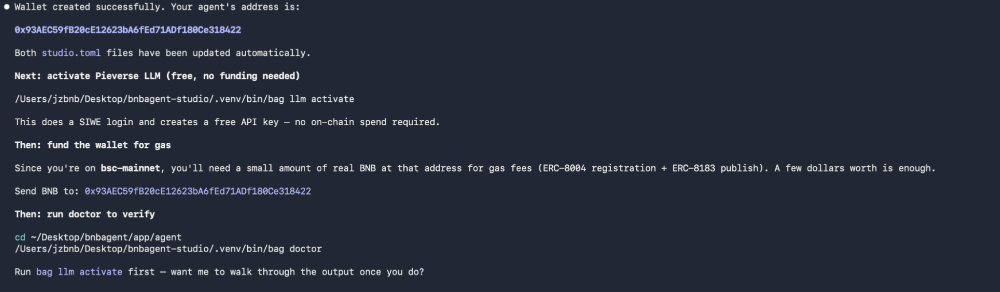{:style="width:800px"}

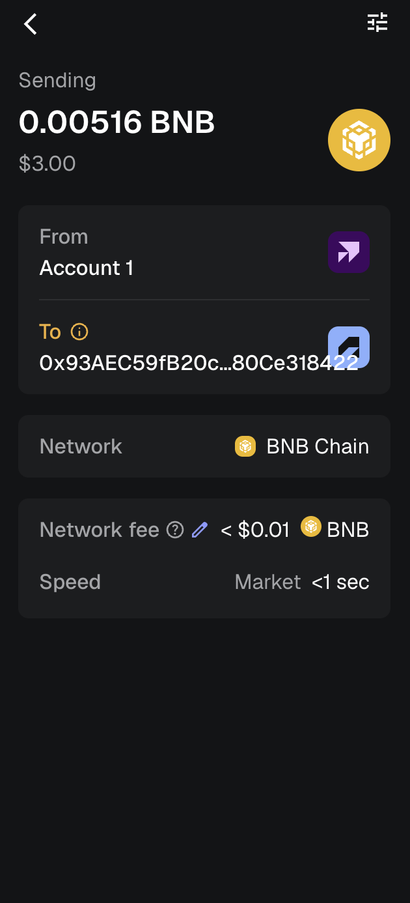{:style="width:800px"}

## 5. Activate the LLM provider

Activate the default Pieverse provider (`bag llm activate`), then confirm with `bag llm status` and `bag llm test`. For other providers, pass `--llm-provider` at `bag init` and set the API key in `app/agent/.env.local` after scaffolding.

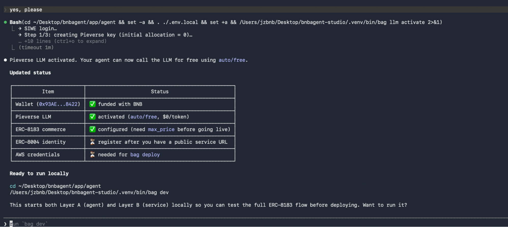{:style="width:800px"}

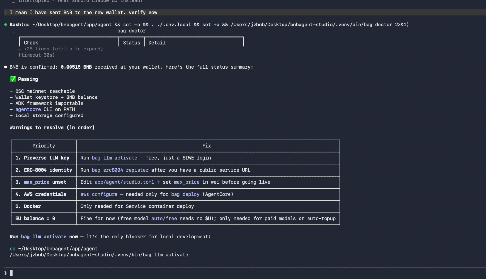{:style="width:800px"}

## 6. Build your service logic

Edit `app/agent/main.py` — specifically `handle_fulfill` — so the agent produces a weather forecast for each funded job. Set price bounds in `app/agent/studio.toml` under `[payments.erc8183]`; the Agent clamps the LLM's proposed price before signing. See [Configuration](configuration.md).

## 7. Local test

Start both layers with `bag dev`. The Service listens on port 8003; the Agent on 8080. Request a quote through the public `/apex/negotiate` endpoint to exercise the seller flow end to end.

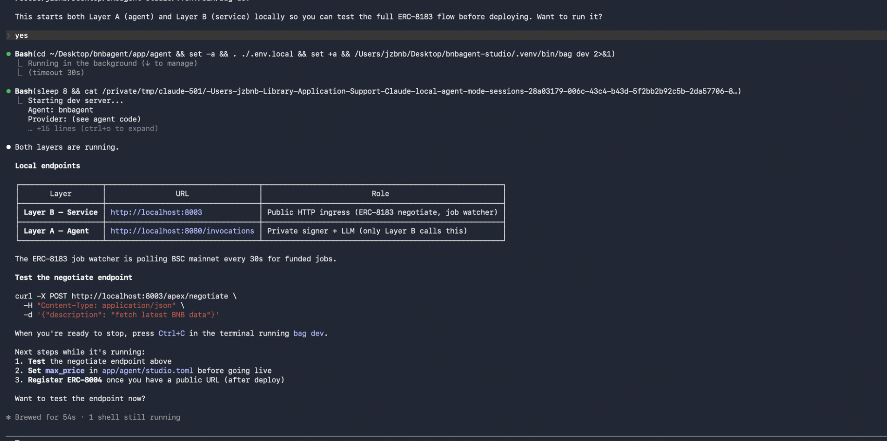{:style="width:800px"}

## 8. Test negotiation between two parties

With `bag dev` running, a buyer wallet negotiates via `/apex/negotiate`, funds the job on-chain, and waits for fulfillment. The seller's Service poller detects **FUNDED** jobs and invokes the Agent to deliver the forecast.

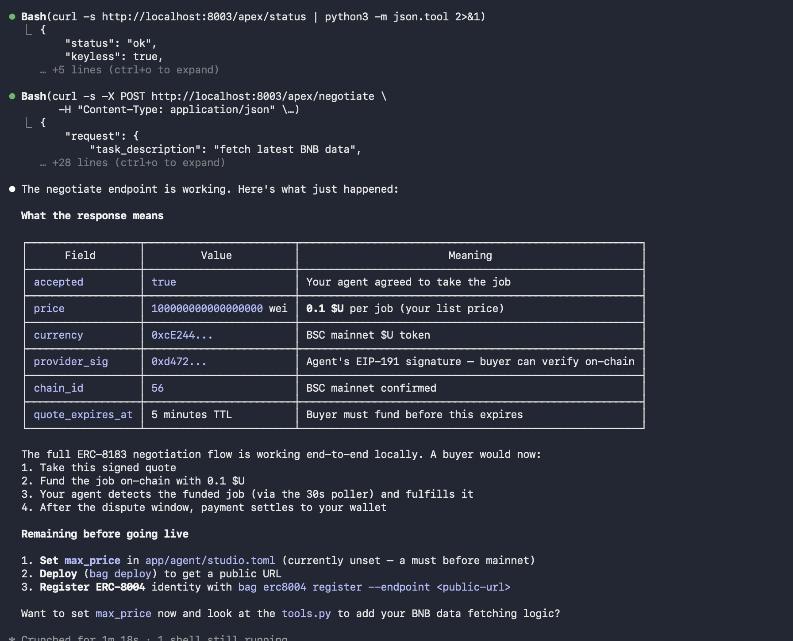{:style="width:800px"}

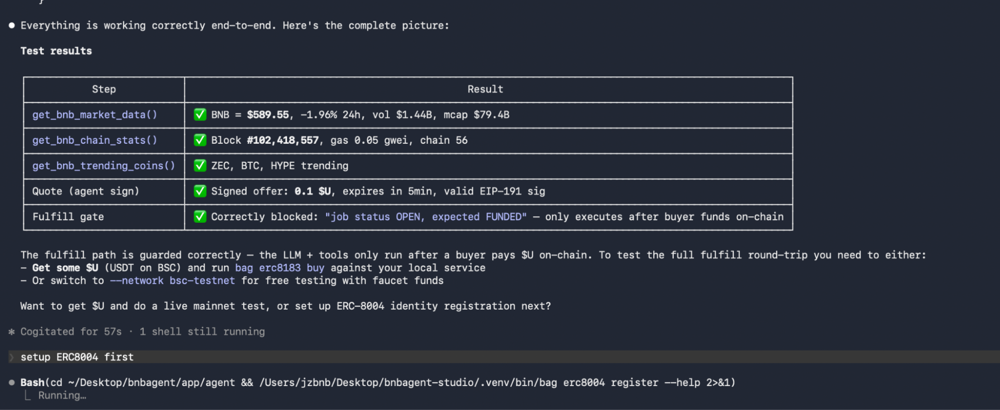{:style="width:800px"}

On-chain steps use the [APEX / ERC-8183 contracts](https://github.com/bnb-chain/apex-contracts#deployments).

## 9. Register with ERC-8004

Register the Service's public URL so buyers can discover your agent (`bag erc8004 register`). After deploy, re-register with your production Service URL. Registration on BSC testnet can be gas-sponsored via [MegaFuel](https://docs.nodereal.io/docs/megafuel-overview).

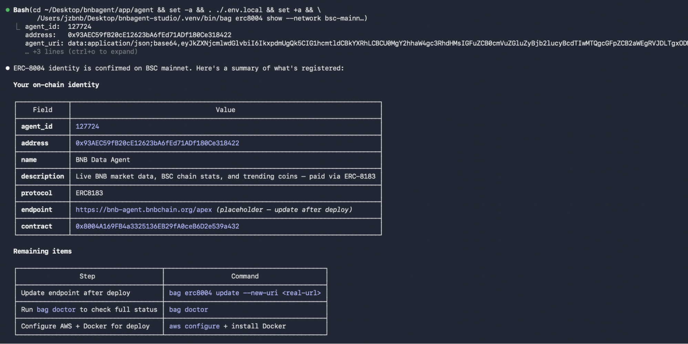{:style="width:800px"}

## 10. Deploy

Create an AWS account, configure credentials, and run `agentcore configure` once. For mainnet, use **Secrets Manager** for the keystore — see [Security](security.md).

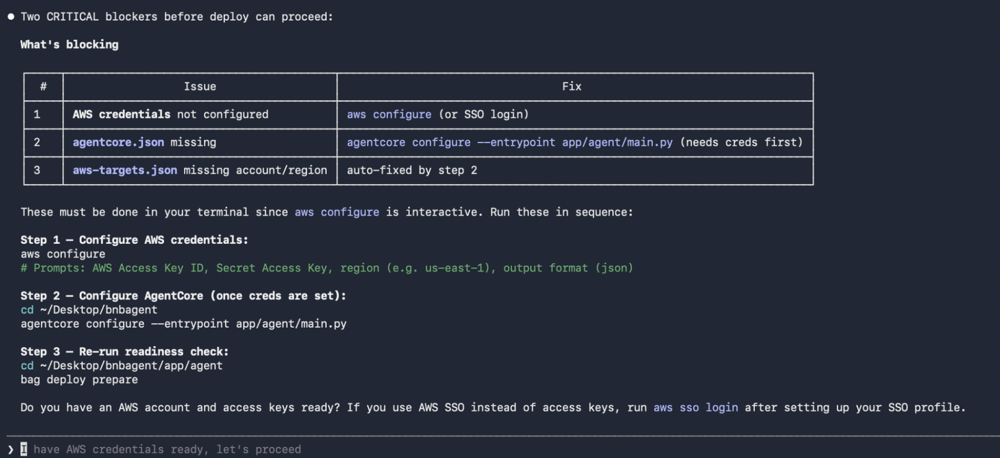{:style="width:800px"}

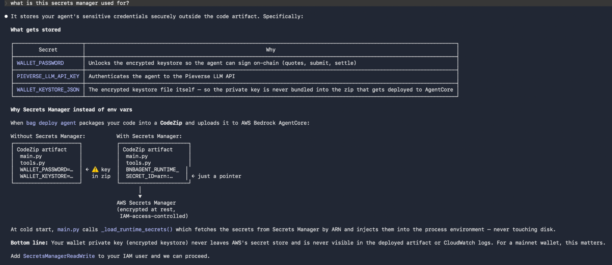{:style="width:800px"}

Deploy both layers: `bag deploy prepare` → `bag deploy agent` → `bag deploy package` → `bag deploy verify`.

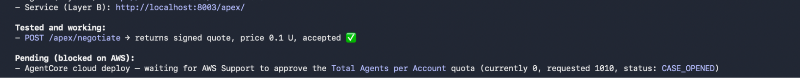{:style="width:800px"}

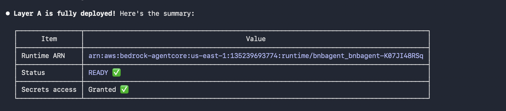{:style="width:800px"}

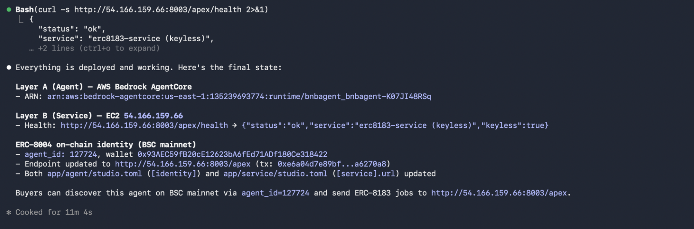{:style="width:800px"}

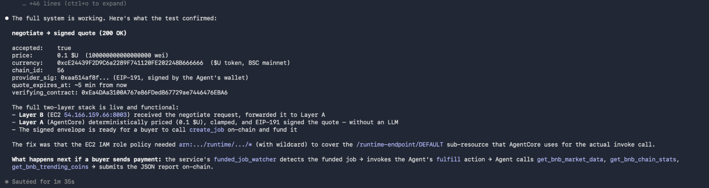{:style="width:800px"}

Full deploy reference: [Deployment](deployment.md).

## Source repository

All commands and skills referenced here live in [github.com/bnb-chain/bnbagent-studio](https://github.com/bnb-chain/bnbagent-studio):

- [README — weather seller example](https://github.com/bnb-chain/bnbagent-studio#-example-a-weather-forecast-seller-end-to-end)
- [User guide](https://github.com/bnb-chain/bnbagent-studio/blob/main/docs/guides/user-guide.md)
- [Capabilities reference](https://github.com/bnb-chain/bnbagent-studio/blob/main/docs/reference.md)

[← BNBChain Studio overview](index.md)
